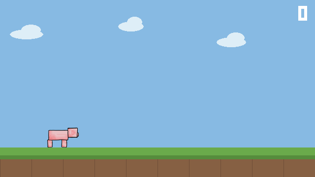

# Pig Runner



A Minecraft-flavored endless runner built as an RL environment. A pig
auto-runs right; sweet berry bushes, snow golems, and elevated grass
platforms come at it — jump, or take the high road, which has its own
hazards to clear once you're up there. Built to train under
[r2dreamer](https://github.com/NM512/r2dreamer) (DreamerV3), but the
interface is plain Gym-shaped enough to point any algorithm at it.

Not affiliated with or endorsed by Mojang — inspired by Minecraft, built with
entirely original art and code.

[](https://colab.research.google.com/github/Sweeyya/pig-runner/blob/main/notebooks/train_and_watch.ipynb)

## Why this exists

The environment is deliberately small: 11 numbers in, 2 actions out, no
pixels anywhere near the agent. That's what makes training fast enough to
iterate on a laptop-class GPU (or Colab's free tier — see below). The design
choices are covered in more depth further down, but the short version: every
hazard exposes a continuous "what's coming and how high" signal instead of a
type label, so the agent has to read the situation, not memorize a pattern.

## Try it

```bash
git clone <this repo>
cd pig-runner
python3 -m venv .venv && .venv/bin/pip install -r requirements.txt
.venv/bin/python play.py                 # SPACE jump
.venv/bin/python play.py --mode expert   # what "solved" looks like
.venv/bin/python play.py --mode random   # the untrained baseline
```

`D` toggles a debug overlay (hitboxes + the live observation vector), `R`
resets, `ESC` quits.

## Toggle features in `config.py`

Every hazard is a flag. Flip one, run `play.py`, get a different game — no
other code changes needed:

```python
ENABLE_SNOW_GOLEM = True   # needs the jump's peak actually over it -- tighter timing than a bush
ENABLE_PLATFORMS  = True   # alternate route over a bush -- with its own hazards on deck
ENABLE_SPEED_RAMP = True   # pace picks up over the episode
```

Both hazard flags off reproduces the original minimal version exactly: one
hazard (the bush), two actions, fixed speed.

## The game

| | |
|---|---|
| Actions | `0` nothing, `1` jump |
| Hazards | bush (easy timing), snow golem (tighter timing -- the jump's peak has to land on it) — either can appear on the ground or on a platform's deck |
| Observation | 11 floats, **never pixels** — see below |
| Reward | +1 per hazard cleared, 0 otherwise, 0 on death |
| Episode ends | on death; capped at 1000 steps (~20s at 50 steps/s) |
| Speed | ramps from 200 to 340 px/s over the episode |

A platform is terrain, not a hazard — it always spans a ground-level bush,
so there's always a route underneath. Jumping onto one instead skips that
bush, but the deck itself may carry its own bush or snow golem to clear
while riding it, so the elevated route isn't a free bypass.

Baselines with everything on, measured in cumulative reward (hazards
cleared) rather than the on-screen counter (which ticks by seconds
survived, not hazards -- see below): random policy scores **0** and dies
within the first few hundred steps; a scripted policy that reads each
hazard's height correctly scores **9-11** and survives the full cap. That
gap is the learning signal.

## Observation

| # | Value | Notes |
|---|---|---|
| 0 | distance to next ground hazard | fraction of screen width |
| 1 | pig height above ground | 0 when grounded |
| 2 | vertical velocity | positive is up |
| 3 | on ground | 0 or 1 (true whether on real ground or a platform's deck) |
| 4 | current speed | normalized 0 (start) to 1 (ramp cap) — without this, "distance" alone would mean a different amount of reaction time depending on speed |
| 5, 6 | next ground hazard's bottom/top band | the height range it occupies above ground — not a type label, so the agent reads geometry rather than memorizing a category |
| 7, 8 | next platform's distance/height | clipped far/0 if none is coming |
| 9, 10 | next platform-deck hazard's bottom/top band | same idea as 5/6, but for whatever's waiting on the platform itself — 0/0 if the platform (or no platform) carries none |

Ground and platform-deck hazards get separate observation fields on purpose:
both can matter to the agent at once (which one to jump for depends on
whether it's currently riding a platform or not), so collapsing them into
one shared field would hide information rather than simplify it.

Jump is a single fixed-height arc, Chrome-Dino style: press while grounded
and it launches the full jump; holding or releasing afterward does nothing.
A shorter, held-for-less jump was tried and dropped -- the bush is wide
enough that reliably clearing it needs an arc that stays up almost as long
as the full jump anyway, so there's no real lower height worth holding for.
Hazards are told apart by *when* you have to press (a bush forgives a wide
window; a snow golem needs the jump's peak actually over it, a tighter
window), not by how the button is pressed.

## Files

| File | |
|---|---|
| `world.py` | shared constants (canvas size, ground line, pig geometry) |
| `game.py` | pure game logic — no pygame, no gym, no RL deps |
| `hazards.py` | each hazard type + the weighted spawn registry `config.py` drives |
| `config.py` | the toggles and tunables described above |
| `env.py` | r2dreamer-compatible wrapper |
| `render.py` | pygame renderer, rectangles now, sprites when you draw them |
| `play.py` | play it yourself / watch a policy / record a gif |
| `assets/README.md` | the art spec to draw against |
| `integration/` | drop-in config and code for r2dreamer |
| `notebooks/` | Colab notebook: train on a free GPU, watch results inline |

## Wiring into r2dreamer

The interface matches r2dreamer's own envs (old-gym signatures, dict obs
carrying `is_first`/`is_last`/`is_terminal`), so no adapter is needed.

1. Copy the logic files into r2dreamer:
   ```bash
   cp world.py game.py hazards.py config.py <r2dreamer>/envs/
   cp env.py <r2dreamer>/envs/pigrunner.py
   ```
2. Copy `integration/pigrunner.yaml` to `<r2dreamer>/configs/env/pigrunner.yaml`.
3. Add the branch in `integration/make_env_branch.py` to `make_env()` in
   `<r2dreamer>/envs/__init__.py`.
4. Train:
   ```bash
   python train.py env=pigrunner
   ```

Two things worth knowing about that wiring:

- **The 1000-step cap is not implemented here.** r2dreamer's `wrappers.TimeLimit`
  owns it via `time_limit: 1000`. This env only reports real death, by setting
  `info["discount"] = 0.0`. That keeps death a *termination* (future worth zero)
  and the step cap a *truncation* (future still worth something) — collapsing
  the two would teach the agent that surviving is as bad as dying.
- **`render.py` is never imported during training.** r2dreamer runs `env_num`
  copies in subprocesses, and 16 of them opening windows would be a mess.
  Rendering is opt-in, via `play.py` or `env.render()`.

## No local GPU? Use Colab

DreamerV3 trains a world model, which benefits meaningfully from a GPU even
on an observation this small. `notebooks/train_and_watch.ipynb` clones the
repo, installs everything, trains on Colab's free-tier GPU, then renders a
rollout to a GIF and displays it inline — no terminal, no window, nothing
local required. Recommended for anyone trying this out, not just people
without a GPU: it's the zero-setup path.

## Watch the world model dream

DreamerV3 trains its policy almost entirely on trajectories it *imagines*
inside its own learned world model, never touching the real environment for
most of training. The same notebook has an optional section that makes this
visible: give the model a few real steps of context, then let it roll
forward purely on its own predictions (using the actions that were actually
taken next), and render both feeds side by side — real game on top, decoded
imagination on the bottom. Where they diverge is where the model's
understanding breaks down, which says something about what it has actually
learned, not just how well it scores.

This needs its own training run: r2dreamer's default mode trains *without*
a decoder at all (that's where its speed advantage comes from), so there is
nothing to turn imagined states back into numbers with. `model=pigrunner_dream`
switches on the classic reconstruction objective to make this possible,
trading some speed for it — that's a separate, optional run, not a
requirement for normal training.

## Not in this version, by design

Mining through blocks and placing blocks to bridge gaps — the original v0
scope deliberately started smaller than this and grew from there; those two
remain a natural next step. Day/night was considered and left out; it
wouldn't change the observation or the decision-making, just the palette.
Flight was considered and cut entirely: with no cost it would dominate every
other action, so the agent would just fly the whole episode and learn
nothing.
